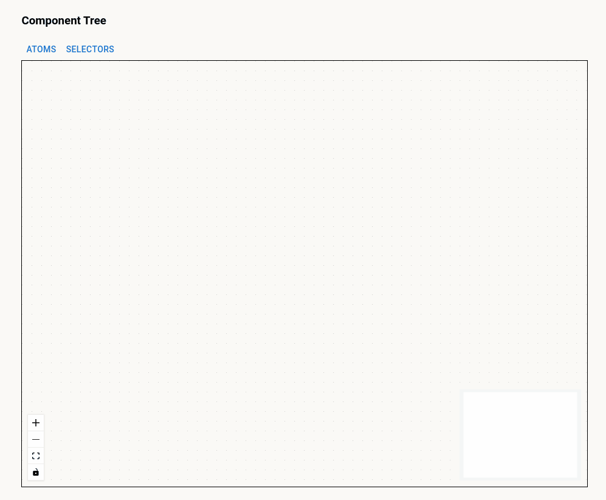
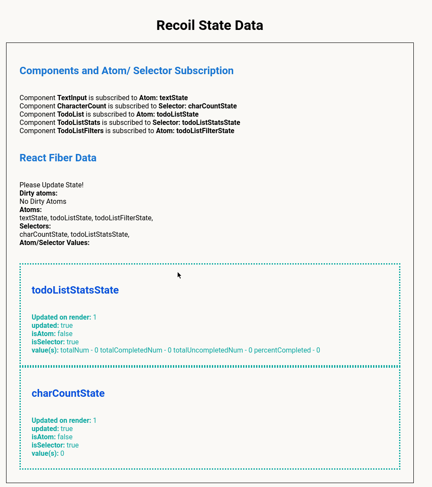
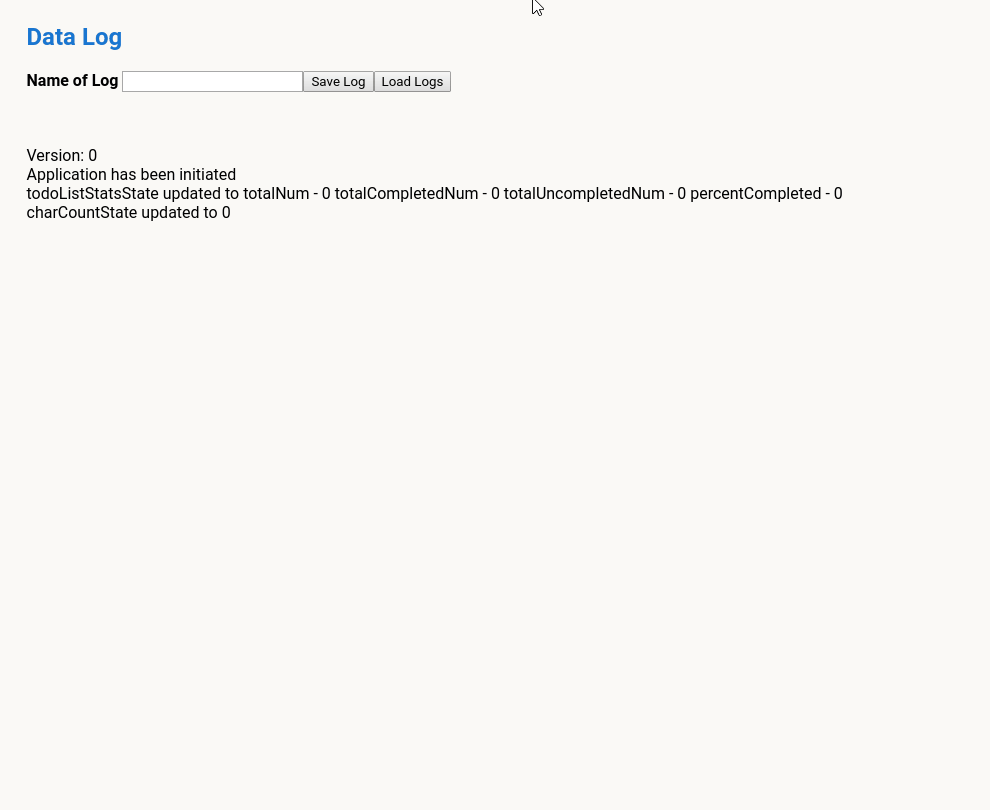

 
# [SmoreJS](https://smorejs.com) &middot; [](https://github.com/oslabs-beta/smorejs/blob/master/LICENSE) 

[![Contributors][contributors-shield]][contributors-url]
[![Forks][forks-shield]][forks-url]
[![Stargazers][stars-shield]][stars-url]
[![Issues][issues-shield]][issues-url]
[![MIT License][license-shield]][license-url]
<!-- [![LinkedIn][linkedin-shield]][linkedin-url] -->
 
## SmoreJS
 
### State Management Optimization for Recoil
 
SmoreJS is an Electron based GUI that provides a testing environment for applications using Recoil. When a user's application is loaded, Smore displays the application and its initial state. Upon clicking the update button, users will be able to see an interactive component tree that visualizes component relationships and subscriptions to atoms and selectors. When the state from the user's application change, Smore updates the component tree to reflect the change by highlighting the node of the component that updated. Users are also able to see all the state data from their application. Smore will log the differences between each render and the user can store and save this data in a database. Smore facilitates the optimization of users' applications by allowing the users to visualize the changes in state in Recoil atoms and selectors for an easier debugging process.

****
SmoreJS was built in a Node.js environment with an Electron shell. It is primarily written in TypeScript and uses Facebook's experimental Recoil library for state management.

# Installation
 
To test your application with SmoreJS:
 
Clone this repository to your machine.

```bash
 git clone https://github.com/oslabs-beta/SmoreJS.git
```

Install all dependencies.

```bash
npm install
```

Run the application to be tested 
 
Next run the SmoreJS app. Go to the SmoreJS directory in your terminal and run

```bash

npm run dev:react
```
 
then open another terminal the SmoreJS directory and run
 
```bash

npm run dev:electron
```

When Electron opens on your machine, create a login.

Once you get to the application screen enter the localhost url where your app is running. For example http:localhost:3000
 

### How to Analyze your apps state
 
Electron Shell
The user enters and loads the URL of their Recoil application and clicks update. 

<p align="center">
  
</p>

## Component Tree
Upon clicking update, Smore will display an interactive component tree that shows component parent, sibling, and child relationships. The component tree also highlights which component has been updated in the most recent update. There are also atom and selector dropdown menus in which users can click specific atoms and selectors and the component that is subscribed to that atom or selector will change color.

<p align="center">
  
</p>

## State Data Display
In this display you can see an in depth view into the application's state. You can see your application's components and the atoms or selectors that they are subscribed. You can see how many times a component has rendered and the values of the current state. 

<p align="center">
  
</p>

## Users' Log
Users are also able to see logs of their state data, which include the version number of the render and differences in state values. They are also able to save these logs into a database. 
 
<p align="center">
  
</p>
 


# License
Distributed under the MIT License. See [`LICENSE`](https://github.com/oslabs-beta/SmoreJS/blob/main/LICENSE) for more information.


[@Medium](https://eileenlee115.medium.com/introducing-smorejs-state-management-optimization-for-recoil-9963a069e201)
[@SmoreJS](http://smorejs.com)


# The Engineers

:fire: Brian Liang - [@GitHub](https://github.com/brian-z-liang/) - [@LinkedIn](https://www.linkedin.com/in/brian-z-liang/)

:fire: Eileen Lee - [@GitHub](https://github.com/eileenlee115/) - [@LinkedIn](https://www.linkedin.com/in/eileenlee115/)

:fire: Will Ramirez - [@GitHub](https://github.com/diamondHands911) - [@LinkedIn](https://www.linkedin.com/in/william-ramirez-86a4438b/)

:fire: Phillip Sturgeon - [@GitHub](https://github.com/sturgeonphillip) - [@LinkedIn](https://www.linkedin.com/in/sturgeonphillip/)

[contributors-shield]: https://img.shields.io/github/contributors/oslabs-beta/SmoreJS.svg?style=for-the-badge
[contributors-url]: https://github.com/oslabs-beta/SmoreJS/graphs/contributors
[forks-shield]: https://img.shields.io/github/forks/oslabs-beta/SmoreJS.svg?style=for-the-badge
[forks-url]: https://github.com/oslabs-beta/SmoreJS/network/members
[stars-shield]: https://img.shields.io/github/stars/oslabs-beta/SmoreJS.svg?style=for-the-badge
[stars-url]: https://github.com/oslabs-beta/SmoreJS/stargazers
[issues-shield]: https://img.shields.io/github/issues/oslabs-beta/SmoreJS.svg?style=for-the-badge
[issues-url]: https://github.com/oslabs-beta/SmoreJS/issues
[license-shield]: https://img.shields.io/github/license/oslabs-beta/SmoreJS.svg?style=for-the-badge
[license-url]: https://github.com/oslabs-betaSmoreJS/blob/main/LICENSE
<!-- [linkedin-shield]: https://img.shields.io/badge/-LinkedIn-black.svg?style=for-the-badge&logo=linkedin&colorB=555 -->
<!-- [linkedin-url]: https://www.linkedin.com/company/getatomos/ -->
